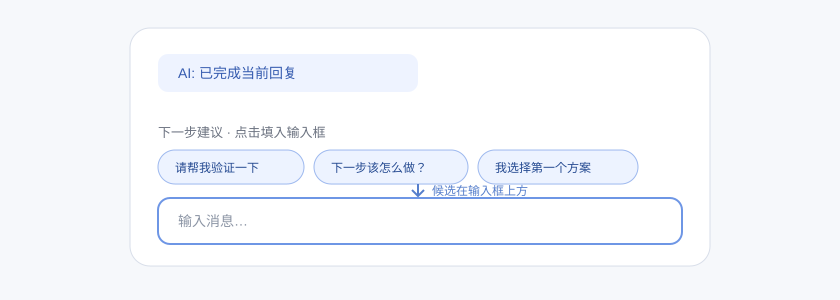

# dsh-suggested-replies

DSH Web 的“预测回复”插件：AI 回复结束后，生成几条用户下一步可能会发送的消息候选，并将它们显示在**聊天输入框上方**。点击候选只会将文本填入输入框，**不会自动发送**。



## 行为

```text
AI 完成本轮回复
  -> 辅助 LLM 根据近期对话生成候选
  -> 把辅助请求的路由、system prompt、user prompt 和 maxTokens 写入非 surface Session 事件
  -> Web 在 conversation.input.dock（输入框上方）显示气泡
  -> 点击候选：inputActions.setDraft(text)
  -> 用户自行编辑或点击发送
```

- **正确位置**：注册 `conversation.input.dock`，位于 DSH 的消息输入卡片上方；不会放到输入框下方的 `conversation.composer.dock`。
- **只填入草稿**：点击候选会替换当前草稿为该候选，不会调用发送动作。
- **候选内容**：优先覆盖合理的下一步执行、验证/追问、或决策/选择；候选跟随最近对话语言，彼此去重且可直接发送。
- **过期保护**：新用户输入、设置关闭、辅助调用超时或插件卸载都会取消当前生成，避免旧结果在下一轮对话中回流。
- **模型调用与成本**：每个可生成候选的完成轮次额外发起一次短文本 LLM 调用，优先复用 Session 最新 `request/header` 中实际使用的 provider/model，再回退到 Agent 默认路由。关闭开关后不再发起该调用。

## 安装

### 从 GitHub 安装

```sh
dsh plugin --profile web add github:dsh-external/dsh-suggested-replies
```

### 本地开发目录安装

```sh
dsh plugin --profile web add /absolute/path/to/dsh-suggested-replies
```

安装或更新后，重启正在运行的 `dsh web` 服务，并在浏览器硬刷新页面。新建或重新打开一个会话后进行验证。

## 设置与配置

Web 设置页中的“下一步建议”分区提供 `enabled` 总开关。它写入 `$DSH_HOME/settings.yaml` 的 `suggested-replies` 区域，下一轮立即生效。

其余部署参数在 `cordis.patch.yml` 或 profile overlay 中配置：

| 字段 | 默认值 | 说明 |
| --- | ---: | --- |
| `enabled` | `true` | 是否生成候选；关闭后无辅助模型调用。 |
| `suggestionCount` | `3` | 每轮候选数量，范围 `2-4`。 |
| `contextMessageCount` | `4` | 传给辅助模型的最近可见消息数，范围 `2-6`。 |
| `maxSuggestionChars` | `160` | 单条候选保留的最大字符数，范围 `32-300`。 |
| `maxTokens` | `384` | 辅助调用的最大输出 token，范围 `64-1024`。 |
| `timeoutMs` | `15000` | 辅助调用最长时长（毫秒），范围 `1000-30000`。 |

示例 overlay：

```yaml
- patch:
    - id: suggested-replies
      config:
        suggestionCount: 4
        maxSuggestionChars: 120
        timeoutMs: 10000
```

## 开发与验证

```sh
export DSH_SOURCE=/path/to/deepseek-harness
pnpm install --no-frozen-lockfile
pnpm run links
pnpm run typecheck
pnpm run test
pnpm run build
pnpm pack --dry-run
```

提交前的独立 Profile 验证：

```sh
TEMP_DSH_HOME="$(mktemp -d)"
DSH_HOME="$TEMP_DSH_HOME" dsh plugin --profile web add /absolute/path/to/dsh-suggested-replies
DSH_HOME="$TEMP_DSH_HOME" dsh --profile web --dump-config
```

实际页面验收要点：

1. AI 回复结束后，候选行的几何位置在 `[data-composer-card]` 上方。
2. 点击候选后，textarea 草稿变为候选文本。
3. 点击候选后不会创建下一轮、不会自动发送消息。

## 致谢

本项目是独立实现，并明确致谢 [dsh-external/dsh-auto-blame](https://github.com/dsh-external/dsh-auto-blame) 的架构贡献：本插件“主机事件 -> Session Projection -> Web slot”的双端组合思路参考了该仓库提交 `ad3291724cd20d4757c1d370a1cc3e3a7766f1b8`。

本项目重新实现了产品语义、事件名、提示词、过期结果处理、输入框上方布局和“只填入不发送”的交互；未包含该项目的源代码、图像或品牌资产。

## License

[MIT](LICENSE)
